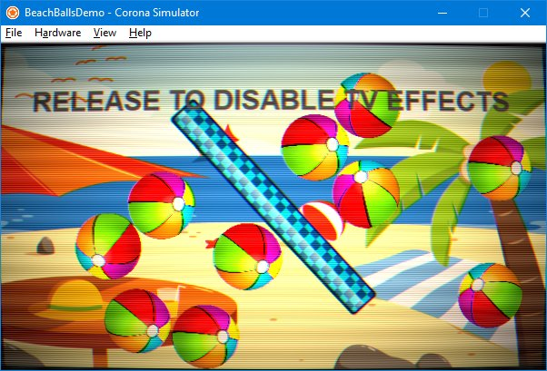
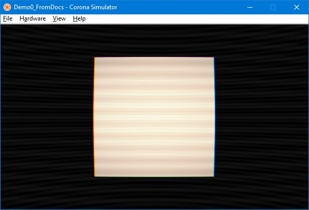

"TVShader" is a shader for Corona SDK that implements old-school style CRT effects.  It is intended for use when a full-screen effect is desired.  (It is not appropriate for filter-style use on non-full-screen areas.)



# Basic Usage

Copy the TVShader.lua module into your project folder.  You may also copy it into a subdirectory of your project folder, though you'll need to account for that path in the sample code below.

Require the TVShader module within your code where it will be used.
```lua
local TVShader = require("TVShader")
```

Create two display groups - one to hold the original "contents" of your display, and one to hold the output from the effect.
```lua
local contentGroup = display.newGroup()
local outputGroup = display.newGroup()
```

Create an instance of the shader, passing it references to the two groups:
```lua
local tvshader = TVShader({
  contentGroup = contentGroup,
  outputGroup = outputGroup
})
```

That's basically it.

The effect will now be active, but only a bit of interference lines will be visible on the otherwise blank screen.

In order to actually _notice_ the effect it would help to have some actual content within the content group, even a simple square will do...
```lua
local rect = display.newRect( contentGroup,
  display.contentCenterX, display.contentCenterY,
  200, 200 )
```


Turning the effect off is accomplished by destroying the instance.

The destroy method takes an optional parameter of a display group to which it should "return" the original contentGroup.

For this demo, since the contentGroup was originally created in the display's primary stage, that would also be the appropriate group to return it to...
```lua
tvshader:destroy( display.getCurrentStage() )
```
